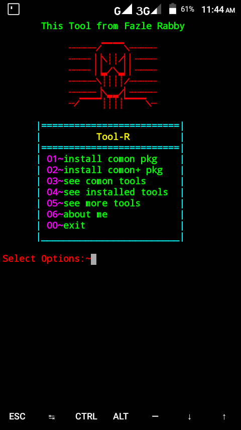

# Tool-R

This tool from fazle rabby.You can easily install packages and hacking tools just one click by using this tool....

 
# installation in termux

- $pkg install git -y

- $git clone https://github.com/fh-rabbi/Tool-R

- $ls

- $cd Tool-R

- $chmod +x *

- $ls

- $./fazle.sh

# Now enjoy this tool & say thanks>

# Tool screenshot :

